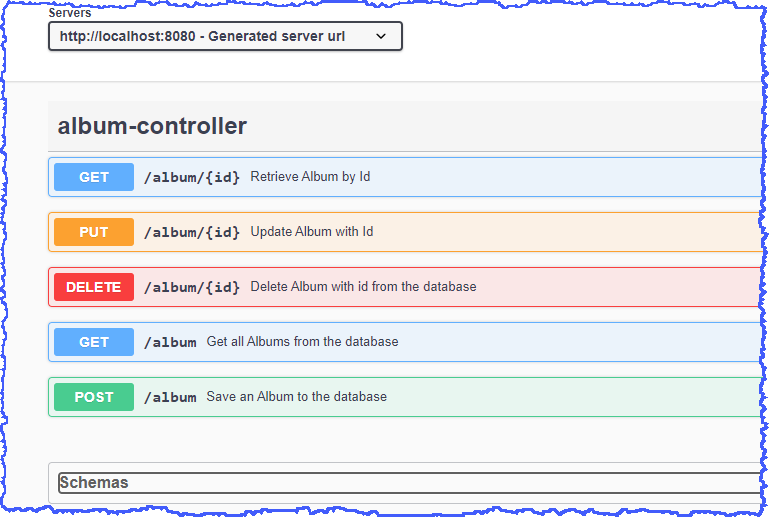

# Spring Boot - Ecommerce Application

### Areas covered

For further reference, please consider the following sections:
#### Web
* _Spring Boot Starter Web_
* Lombok
* Web Layer - REST endpoints, HTTP methods added to Package com.example.springbootecom.controller
* Web Layer Testing - @WebMVCTest(AlbumController.class) / MockMVC
* _Spring Boot Starter Validation_
* Validation of **AlbumRequestDTO** at REST endpoints
* Custom Validation aswell as Spring out-of-the-box validations

#### Exception Handling
* Add an Exception Handler _@RestControllerAdvice_ Package com.example.springbootecom.exception
* Bespoke ServiceResponse (instead of ResponseEntity) to improve Response to User

#### Data Layer


* Spring Boot Starter JPA (using H2 database initially)
* application.properties - enable H2 console

```yaml
spring:
  h2:
    console:
     enabled: true
    driver:
      username: sa
      password:
  datasource:
     url: jdbc:h2:mem:testdb
```


* Add DTO, DAO - Album CRUD Repository, Entity to isolate txfer data between layers

#### Testing
* Web Layer Testing - testing endpoints - CRUD operations
* Using @WebMvcTest and MockMVC
* Test raising and handling exceptions _@RestControllerAdvice_

#### Logging
* _Spring Boot Starter Logging_ included as part of _Spring Boot Starter Web_ which implements Logback (default) - logback-core & logback-classic (SL4J API)
* application.properties - set logging level to DEBUG during dev
```yaml
logging:
  level:
    com.example.springbootecom: DEBUG
  file:
    name: app.log
```

* Define logger.info, logger.debug, logger.error
* Add logging into Service and Controller
* Handler - Write to logfile

#### Documentation using Swagger/OpenAPI 3

```xml
<dependency>
    <groupId>org.springdoc</groupId>
    <artifactId>springdoc-openapi-ui</artifactId>
    <version>1.6.4</version>
</dependency>
```
then use this link

```plaintext
http://localhost:8080/swagger-ui/index.html
```
or
```plaintext
http://localhost:8080/v3/api-docs
```

for JSON

